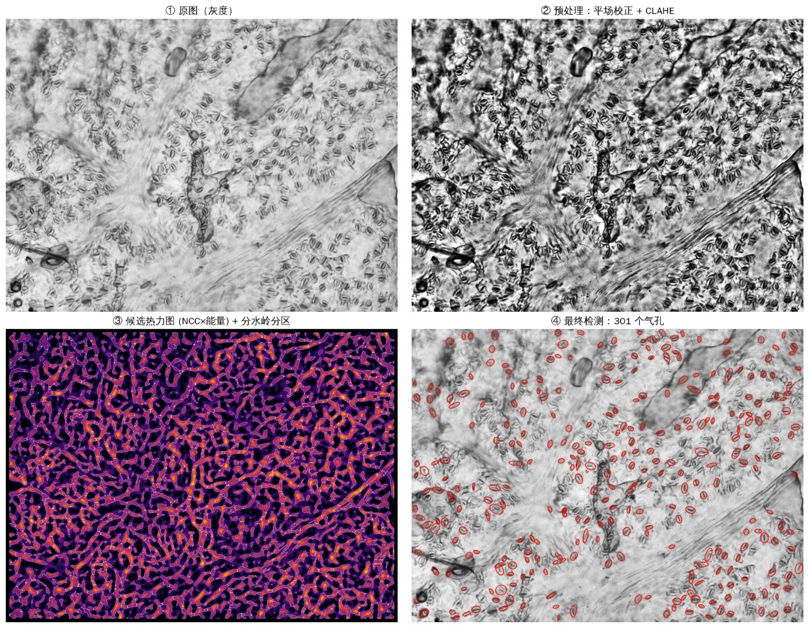

# 叶表皮显微图像气孔（Stomata）自动检测与计数

面向高分辨率叶表皮透射显微图像的气孔检测、定位与计数工具，分两个阶段：

| 阶段 | 方法 | 依赖 | 适用 |
|---|---|---|---|
| **一：免训练基线** | 平场校正 + CLAHE + 自举模板旋转 NCC + DoH 斑点 + 分水岭 + 多维几何/结构硬过滤 | OpenCV / scikit-image / SciPy | 没有标注；快速估计；为深度模型生成预标注 |
| **二：生产级深度学习** | YOLOv8-P2（小目标检测头）+ SAHI 切片推理，点标注小样本微调 | + Ultralytics / SAHI（GPU） | 追求高精度，愿意投入少量人工校正 |



---

## 快速开始

```bash
pip install -r requirements.txt

# 单张图：CSV + 检测标注图 + 流水线四联图 + 与参考标注对比的 P/R/F1
python scripts/count_stomata.py data/samples/leaf_epidermis_01.jpg -o outputs --visualize \
       --eval data/annotations/leaf_epidermis_01_partial.json

# 20x 彩色 TIFF 系列：用测微尺图像自动标定 µm/px，气孔尺寸按物理长度给出
python scripts/count_stomata.py "data/samples/test0*.tif" -o outputs \
       --micrometer "data/samples/stage micrometer 20x objectivetif.tif" --stoma-size-um 28

# 已知像素尺寸时直接给出（导出 µm 与 气孔密度 /mm²）
python scripts/count_stomata.py "images/*.tif" -o outputs --um-per-px 0.50 --stoma-size-um 28
```

```python
import cv2
from stomata import StomataCounter, DetectorConfig, visualize_pipeline, calibrate_stage_micrometer

cal = calibrate_stage_micrometer(cv2.imread("data/samples/stage micrometer 20x objectivetif.tif"))
cfg = DetectorConfig(um_per_px=cal.um_per_px, expected_major_um=28, margin_exclusion=True)
counter = StomataCounter(cfg)
reports = counter.run("data/samples/test001.tif")          # 文件 / 目录 / 通配符
counter.export_csv(reports, "outputs/stomata.csv")          # 逐气孔明细 + 汇总
rep = reports[0]
print(rep.count, rep.rows()[:3])                            # 总数、坐标、长轴
visualize_pipeline(cv2.imread("data/samples/test001.tif"), rep.result, save_path="outputs/pipeline.png",
                   zoom=(300, 150, 750, 480))
```

输出文件：

| 文件 | 内容 |
|---|---|
| `stomata_detections.csv` | 每个气孔一行：`image, id, x, y, major_axis_px, minor_axis_px, angle_deg, score, major_source, major_axis_um, minor_axis_um` |
| `stomata_detections_summary.csv` | 每张图一行：总数、密度 (/mm²)、长轴均值/标准差/中位数、候选数、边缘剔除数 |
| `*_detections.jpg` | 检测椭圆叠加图 |
| `*_pipeline.png` | 原图 / 预处理增强 / 候选热力图+分水岭 / 最终检测 四联图（`visualize_pipeline()`） |
| `*_points.json` | 点标注格式的检测结果，可直接作为人工校正的预标注 |

**唯一必须设置的参数是气孔大小**：`--expected-major`（像素，默认 34）或 `--stoma-size-um` + 标定。
仓库中三类样例图的大致取值：`leaf_epidermis_01.jpg` ≈ 34 px，`1.1.jpg` 等灰度 JPG ≈ 40 px，
20x 彩色 TIFF ≈ 56 px（≈ 28 µm @ 0.50 µm/px）。

---

## 阶段一：免训练流水线

代码：`stomata/preprocessing.py`、`stomata/templates.py`、`stomata/detector.py`

### 1. 预处理增强
透射图像可写成 `I = L·R + n`（L 为叶脉阴影/照明，R 为组织透过率）。
* **平场校正**：`I / (G_σ=40 * I)`，把乘性阴影变成常数。这也是不能用全局阈值 / Otsu 的原因：
  同一种气孔在亮区和叶脉暗区的灰度相差很大。
* **CLAHE**（16×16 分块）均衡局部对比度；**DoG** 带通（σ=1/10）供可视化与扩展使用。
* **黑顶帽 (black-hat)**：`closing(I) − I` 提取宽度 < 9 px 的暗线（保卫细胞壁、裂隙、表皮细胞壁），
  其局部密度作为"暗结构能量"。

### 2. 候选定位与分割
* **自举模板（完全无监督）**：先用合成椭圆环模板在暗结构图上找 60 个最可信的气孔，按二阶矩方向对齐、
  平均并做 4 重对称化，得到数据驱动模板；再按最佳匹配角度对齐迭代一次。模板可以保存
  （`--save-template`），供整批图像复用。
* **旋转 × 尺度 × 长宽比 NCC**：18 个角度 × 3 个尺度 × 2 种长宽比。NCC 对局部亮度/对比度不变，只对结构形状敏感；
  结果再乘以暗结构能量门控，压制空白背景上的噪声相关。
* **多尺度 Hessian 斑点 (DoH)**：在反相平场图上计算 `σ⁴(LxxLyy − Lxy²)`，σ ≈ 长轴/4.5 ~ 长轴/3。
  气孔整体是"暗椭圆斑"，两个主曲率同号且相近；细胞壁、叶脉是线状，det ≈ 0，被压制。
  DoH 可以作为候选图（`candidate_mode="doh"`），默认作为验证特征使用。
* **大图分块**：按 2048 px 分块、96 px 重叠计算响应图，**只写回核心区，拼接成整图响应图后再统一找峰**，
  所以分块边界上的气孔不会被计两次（`tests/test_detector.py::test_tiled_response_equals_full` 验证拼接结果与整图计算逐像素一致）。
* **局部极大值 → 自适应阈值掩膜 → 距离变换 + 标记控制分水岭**，分离粘连的气孔；每个候选再在 ±4 px、±5°、
  更细的尺度/长宽比上精修。

### 3. 几何与结构先验硬过滤（阈值均在 `DetectorConfig` 中可配置）

| 判据（默认阈值） | 物理含义 | 主要剔除 |
|---|---|---|
| NCC 得分 ≥ 0.30 | 与气孔模板的形状相似度 | 噪声 |
| **DoH 斑点强度** ≥ 0.15 | 候选处是否为"暗椭圆斑" | **细胞壁交界点、单条弧线** |
| **轴向延续比** ≤ 0.85 | 沿长轴 ±0.8L 处响应 / 中心响应。气孔有"端点"，叶脉条纹沿长轴延伸（≈1） | **叶脉、平行纤维** |
| **结构张量相干度** ≤ 0.70 | σ=16 邻域内方向一致性；平行纹理 → 1 | 叶脉、纤维束 |
| 内部暗度 ≤ −0.10 | 椭圆内 − 外环的平均灰度 | 空白区、亮斑 |
| 区域面积比 / 偏心率 ≤ 0.99 / solidity ≥ 0.3 / 惯性比 | 分水岭区域形状（区域过小时跳过） | 退化的线状响应 |
| 射线闭合度 / 椭圆拟合残差（默认只用于测量） | 32 条射线上"亮保卫细胞 → 暗外壁 → 外侧回升"，谷点最小二乘拟合椭圆 | 可选：`min_ray_coverage`、`require_ellipse_fit=True` |

射线椭圆拟合给出**长轴直径测量值**（`major_source = ellipse`）；拟合失败时回退为模板尺度估计（`template`）。
最后做中心距离 NMS（中心距 < 0.75 × 短轴视为同一气孔）。

### 4. 边缘剔除（Margin Exclusion）
`margin_exclusion=True`（默认）时剔除不完整的边缘气孔，两种规则：
* `margin_mode="bbox"`：旋转椭圆的外接框越出图像（或 `margin_px` 安全边距）即剔除；
* `margin_mode="center"`：中心距边界 < `margin_px`（默认 0.5 × 长轴）即剔除。

### 5. 物理尺度标定
`stomata/calibration.py::calibrate_stage_micrometer()`：对测微尺图像的刻线剖面做自相关求周期初值，
逐条定位刻线（亚像素），迭代剔除离群刻线后线性拟合得到周期。样例
`stage micrometer 20x objectivetif.tif` 的结果是 **19.90 px/格 → 0.503 µm/px**（61 条刻线，残差 0.47 px，
按每格 10 µm 计算；如果你的测微尺刻度不同，请用 `--division-um` 指定）。

### 6. 评估接口
`stomata/evaluation.py`：`match_points()` 用匈牙利算法做一对一点匹配（距离 ≤ tol），
**重复检测计为 FP**，支持 `ignore` 点；`evaluate_against_annotation()` 支持"只标注若干矩形区域"的部分标注。
CLI 的默认容差为 0.35 × 期望长轴。

---

## 结果（请如实看待）

参考标注在 `data/annotations/`，是人工目视核验的**局部矩形区域**，覆盖三种成像风格，共 41 个气孔：

| 图像 | 风格 | 期望长轴 | 全图计数 | 参考区域 P | R | F1 | 单图耗时* |
|---|---|---|---|---|---|---|---|
| `leaf_epidermis_01.jpg` | 灰度，2000×1500 | 34 px | 301 | 0.81 | 0.74 | 0.77 | ~21 s |
| `1.1.jpg` | 高对比灰度，2560×1920 | 40 px | 212 | 0.56 | 0.63 | 0.59 | ~39 s |
| `test001.tif` | 20x 彩色，1360×1024 | 56 px | 53 | 1.00 | 0.70 | 0.82 | ~8 s |

\* 在本开发容器的 CPU 上测得。

需要注意：
* **参考集很小，而且默认阈值就是在这三组区域上联合标定的**，上表更接近"训练集表现"，不是无偏估计。
* **对整幅图的目视检查表明，全图召回率明显低于上表**：在 `1.1.jpg` 和 `test001.tif` 上，大约只有一半的明显气孔被检出。
  主要漏检是失焦的、开放度很大的、以及与周围暗结构粘连的气孔；主要误检是细胞壁围成的类椭圆小室和叶脉边缘。
* 不同成像风格之间差异很大，每一批图像都需要至少设对气孔尺寸，最好再用少量标注核对一次阈值。
* 在带光照不均、随机细胞壁和叶脉条纹的**合成图**上（`tests/synthetic.py`）P = R = 1.0，
  说明算法逻辑本身正确，真实图的难点在于成像。

**结论**：阶段一适合在没有标注时做快速估计，以及作为阶段二的**预标注工具**。
要做可发表的定量统计，请按下文用少量人工校正数据微调深度模型，并在独立标注的整图上评估。

---

## 阶段二：生产级深度学习方案

详见 [`docs/DEEP_LEARNING.md`](docs/DEEP_LEARNING.md) 与 [`docs/ANNOTATION_GUIDE.md`](docs/ANNOTATION_GUIDE.md)。概要：

* **架构选择**：**YOLOv8s-P2**（增加 stride-4 的 P2 检测头）。任务需要逐个坐标 + 长轴，检测模型能直接给出；
  气孔密度中等、边界可分，不需要 CSRNet/FIDTM 这类只擅长总数的密度估计。需要回归朝向时可换 YOLOv8-OBB。
* **禁止整图缩放**：训练时在原始分辨率上切 640×640（重叠 20%）的小块，推理用 **SAHI** 同样切片，
  各片结果平移回全图后用 **IoS（交集/较小框面积）+ GREEDYNMM** 合并，消除切片边界处的重复计数；
  内置的 `SlicedPredictor` 还提供"中心归属"去重（每个目标只由其中心所在切片的核心区负责）。
* **小样本流程**：阶段一预标注 → 人工在点标注工具里增删 → 点转框 →
  冻结 backbone 微调（`freeze=10`，`degrees=180` 旋转增强）→ 用阶段二模型再预标注下一批（主动学习）。

```bash
python scripts/dl_pipeline.py prelabel images/ -o labels_points/          # 1. 预标注
#   ……人工校正 labels_points/*.json ……
python scripts/dl_pipeline.py build labels_points/ --images images/ -o datasets/stomata   # 2. 切片数据集
python scripts/dl_pipeline.py train datasets/stomata/data.yaml --epochs 150            # 3. 微调（GPU）
python scripts/dl_pipeline.py predict images/ --weights runs/stomata/yolov8s_p2/weights/best.pt -o outputs_dl  # 4. SAHI 推理
```

> 阶段二中，数据集构建和内置切片推理/去重有单元测试；YOLO 训练和 SAHI 调用在本仓库**没有实际训练或运行过**
> （开发环境没有 GPU 和标注数据），使用前请以 Ultralytics / SAHI 当前版本的文档核对参数名。

---

## 目录结构

```
stomata/
  preprocessing.py   平场校正、CLAHE、DoG、黑顶帽、Hessian 斑点图
  templates.py       合成模板、自举数据模板、旋转/尺度/长宽比模板库
  detector.py        ClassicalStomataDetector 与 DetectorConfig（阶段一核心）
  counter.py         StomataCounter：批量读取、计数、CSV 导出
  visualize.py       visualize_pipeline()、draw_detections()
  evaluation.py      Precision / Recall / F1、点匹配、部分区域标注评估
  calibration.py     测微尺 µm/px 标定
  dl/                阶段二：数据集切片、YOLOv8-P2 训练、SAHI/内置切片推理
scripts/
  count_stomata.py   阶段一命令行
  dl_pipeline.py     阶段二命令行（prelabel / build / train / predict）
data/samples/        样例图像（含测微尺图像）
data/annotations/    部分区域点标注（参考集）
tests/               单元测试 + 合成图端到端测试（pytest）
```

## 调参建议

| 现象 | 调整 |
|---|---|
| 放大倍率不同 | 先设对 `expected_major_px`（或 `--stoma-size-um` + 标定），它决定自举、尺度搜索和种子间距 |
| 漏检多 | 降低 `min_blob`（0.10）、`min_score`（0.25），放宽 `max_end_ratio`（0.9） |
| 叶脉上误检多 | 降低 `max_end_ratio`（0.75）或 `max_coherence`（0.6） |
| 细胞壁误检多 | 提高 `min_blob`（0.25），或设 `min_ray_coverage=0.25` / `require_ellipse_fit=True` |
| 很开放的气孔漏检 | `aspects=(1.0, 1.35, 1.7)`，`refine_aspects` 增加 1.8 |
| 整批同条件拍摄 | `--share-template` 或 `--save-template` / `--template` 复用模板，结果更一致 |

调阈值时请用 `--eval` 在自己的标注区域上核对，不要只凭一张图目测。

运行测试：`python -m pytest -q`
