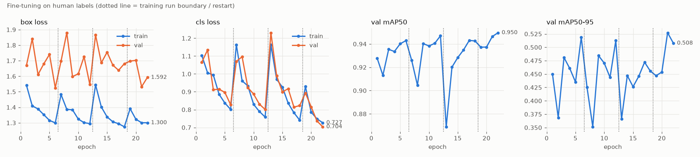

# 训练报告：Stomata_Enhanced 人工标注数据

**当前推荐模型：`models/stomata_yolov8n_p2_human_v2/best.pt`（YOLOv8n-P2，6.3 MB），置信度阈值 0.40**——见第 6 节（数据整理后的 v2 训练）。
第 1–5 节记录的是数据补全前（128 张训练图）的 v1 模型 `models/stomata_yolov8n_p2_human/`。

## 1. 数据结构分析

`data/samples/pre-trainning/Stomata_Enhanced/`：

| 部分 | 内容 | 说明 |
|---|---|---|
| `data.yaml` | `nc: 1, names: [stomata]`，`train: train/images` | `path` 是原作者机器上的绝对路径；仓库中**不存在** `train/images/` 目录 |
| `train/labels/` | 234 个标签，74,765 个框 | 对应图像：6 张在 `train/` 根目录，122 张在 `pre-trainning/images/`；**106 个标签找不到图像** |
| `val/images` + `val/labels` | 59 对，17,490 个框 | 完整 |

- **标签格式**：每行 `0 x1 y1 x2 y1 x2 y2 x1 y2`（归一化 4 角点），全部是轴对齐矩形，不是常见的 `cx cy w h`。各有 1 个退化框（宽或高为 0）被丢弃。
- **框尺寸**：长边中位数约 50 px（第 5–95 百分位 35–70 px，图像 2560×1920）。
- **两种增强风格**：`Stomata_Enhanced` 与新上传的 118 张 `pre-trainning/images` 为同一种彩色增强；最早的 19 张为灰度强对比版本。两种版本几何上完全对齐（相位相关位移 < 0.02 px），因此同一套标签可用于两者。
- **训练/验证无重叠**；与早期伪标签模型的数据有重叠：验证集的 `118.2` 曾在伪标签模型的训练集中，评估该模型时已剔除。

### 标注质量问题

用模型高置信度检测（≥ 0.7）找"距离任何人工框都超过 150 px"的目标，定位整片未标注区域：

| 图像 | 所在集合 | 问题 | 处理 |
|---|---|---|---|
| `108.1_1` | 训练 | 图中有数百个气孔，标签只有 3 个框（标签文件可能对应错了图像） | 从训练集剔除 |
| `349.3` | 训练 | 右侧整片未标注 | 从训练集剔除 |
| `221.2` | 验证 | 只标注了左上约 2/3 | 指标同时报告"含/不含 221.2" |

其余 124 张训练图、57 张验证图未发现成片漏标。另外，原自动计数流程的伪标签与人工标注的一致性仅为 F1 0.88–0.92（`118.2`、`573.2`），这是早期伪标签模型的精度上限。

## 2. 训练过程

数据：126 张训练图 → 1,512 个 640×640 原分辨率切片（4×3 无重叠）；验证 59 张 → 708 个切片。
模型：从伪标签预训练权重 `models/stomata_yolov8n_p2/best.pt` 出发微调（YOLOv8n-P2，CPU，batch 8）。
受运行时限约束，训练分三段，每段约 50 分钟、6 轮（`time=0.85h`），后一段从前一段权重继续：

| 段 | 起点 | 学习率 | 数据 | 末轮 val mAP50 / mAP50-95 |
|---|---|---|---|---|
| ft1 | 伪标签模型 | 0.003 | 128 张 | 0.943 / 0.519 |
| ft2 | ft1 | 0.0015 | 128 张 | 0.947 / 0.512 |
| ft3 | ft2 | 0.001 | 126 张（剔除 2 张不完整标注） | 0.943 / 0.455 |



（图中第 4 段为第 6 节的 v2_b，使用补全后的数据集。）

**收敛判断**：每段重新开启 mosaic 增强后指标先下降，关闭 mosaic 的最后几轮回升到同一水平（mAP50 ≈ 0.943–0.947）；训练损失仍在缓慢下降而验证指标持平。在当前模型规模和输入分辨率下已经收敛，继续加轮数不会带来实质提升。mAP50-95 在 ft3 略低，说明框的贴合度略差，但不影响中心点计数（见下）。

## 3. 测试结果（整图切片推理，人工标注真值）

`scripts/eval_human.py`：整图 640 切片、20% 重叠、中心归属去重；中心点一对一匹配，容差 0.5 × 框长边（约 25 px）。
57 张验证图（剔除 `118.2` 与标注不完整的 `221.2`），每个模型用其 F1 最优阈值：

| 模型 | 阈值 | Precision | Recall | F1 | 计数 MAE | 计数 MAPE | 计数偏差 |
|---|---|---|---|---|---|---|---|
| 伪标签模型（基线） | 0.25 | 0.921 | 0.900 | 0.911 | 25.3 | 8.9% | −6.9 |
| ft1 | 0.40 | 0.927 | 0.951 | 0.939 | 20.4 | 7.4% | +7.9 |
| ft2 | 0.40 | 0.929 | 0.949 | 0.939 | 20.8 | 7.5% | +6.4 |
| **ft3（最终）** | **0.45** | **0.935** | **0.944** | **0.939** | **19.0** | **6.8%** | **+3.1** |

含 `221.2` 的 58 张：ft3 P 0.929 / R 0.945 / F1 0.937 / MAPE 7.6%。

逐图配对检验（Wilcoxon，每图相对计数误差）：ft3 优于 ft2 的图像 35/57（p = 0.014）；ft3 优于基线 36/57（p = 0.078，未达显著）。
**注意**：阈值与模型选择都在同一验证集上完成，以上数字略偏乐观；需要一组从未参与调参的独立标注图像来给出无偏估计。

## 4. 误差分析（ft3，阈值 0.45）

完整表格见 `scripts/error_analysis.py` 的输出。要点：

- **尺寸**：长边 < 40 px 的小气孔召回只有 0.73（共 245 个），40–70 px 为 0.94–0.96，≥ 70 px 为 0.91。
- **密度**：100 px 内有 ≥ 5 个邻居的密集簇召回降到 0.86，≥ 7 个邻居仅 0.22（样本很少，32 个）。
- **边缘**：距图像边缘 < 25 px 的目标召回 0.89（半个气孔，标注口径本身也不一致）。
- **置信度**：≥ 0.7 的预测精确率 0.98；0.4–0.6 区间只有 0.59–0.70，误检集中在这里。
- **误差集中的图像**：`292.1`（−80）、`23.2_1`（−68）、`43.3`、`16.1`、`23.2` 以漏检为主，多为失焦、低对比度的灰色视野；`214.1`、`573.2`、`112.3`、`115.1` 以多检为主。
- **样例**：漏检（`images/fn_gallery_human.jpg`）多为模糊/低对比的气孔和少量明显漏掉的清晰气孔；误检（`images/fp_gallery_human.jpg`）中相当一部分看上去就是人工漏标的真实气孔，其余是圆形气泡/细胞和切片边缘的半个气孔。因此按现有标签算出的精确率偏保守。

## 5. 建议的下一步（按收益排序）

1. **补传 106 张缺失的训练图像**：训练数据可增加约 80%，是当前最大的提升来源。
2. **修正标注**：`108.1_1`、`349.3`、`221.2` 补全；顺带复核 `292.1`、`23.2_1`、`214.1` 等误差最大的图像。
3. **留出独立测试集**：例如 10 张从未参与训练和调参的整图，得到无偏指标。
4. **有 GPU 时**换 YOLOv8s-P2 或提高输入分辨率（如 960 切片），针对 < 40 px 的小气孔与密集簇；在当前 CPU 环境中每轮约 10 分钟，更大的模型不现实。
5. 失焦视野可考虑在预处理或增强中加入模糊/对比度扰动，并在报告中把"失焦区域"作为单独类别统计。

## 6. 数据整理补全后（main 分支 2026-10-09）：v2

### 新数据布局

```
pre-trainning/
├── Stomata_Enhanced/            人工标注数据集
│   ├── data.yaml
│   ├── train/images  train/labels    234 对（全部配齐，统一为彩色增强版本）
│   └── val/images    val/labels      59 对（未变）
└── model_review_samples/        原外部自动计数流程的 20 张审阅图（images/ overlays/ auto_count_results.csv）
```

- 标签内容与之前完全相同；原先缺图像的 106 个标签现在都有图像。
- 用 v1 模型检查新增的 106 张图：没有成片漏标的图。`108.1_1`（3 个框）和 `349.3`（右侧未标注）仍然剔除。
- v2 训练集：232 张 → 2,784 个切片、71,525 个框（约为 v1 的 1.8 倍）。

### 独立测试：v1 模型在 106 张新图上

这 106 张图从未参与 v1 的训练或阈值选择，是真正的独立测试集。用事先确定的阈值 0.45：

| 数据 | Precision | Recall | F1 | 计数 MAPE |
|---|---|---|---|---|
| 验证集 57 张（阈值在此选定） | 0.935 | 0.944 | 0.939 | 6.8% |
| **新增 106 张（独立）** | **0.934** | **0.944** | **0.939** | **7.3%** |

两者几乎一致：验证集上的数字没有因为"在验证集上选阈值"而明显偏乐观，新上传标注的口径也与原有标注一致。

### v2 训练

| 段 | 起点 | 设置 | 末轮 val mAP50 / mAP50-95 | 整图 F1（最优阈值） |
|---|---|---|---|---|
| v2_a | v1 | lr0 0.002，mosaic 开（最后 1 轮关） | 0.944 / 0.507 | 0.9345（阈值 0.35） |
| **v2_b** | v1 | lr0 0.0005，mosaic 关 | **0.950** / 0.508 | **0.9410**（阈值 0.40） |

v2_a 反而比 v1 差（逐图 F1 劣于 v1 的有 45/57 张，p < 0.001）：对已收敛模型用较大学习率重启、轮数又少，被扰动后来不及恢复。
v2_b 用小学习率、关闭 mosaic 从 v1 继续，逐图 F1 优于 v1 的有 39/57 张（Wilcoxon p = 0.011）；逐图计数误差 6.8% → 6.6%（p = 0.20，不显著）。

### v2 最终结果（57 张验证图，阈值 0.40）

| 模型 | Precision | Recall | F1 | 计数 MAE | 计数 MAPE | 计数偏差 |
|---|---|---|---|---|---|---|
| v1（阈值 0.45） | 0.935 | 0.944 | 0.939 | 19.0 | 6.8% | +3.1 |
| **v2（阈值 0.40）** | **0.937** | **0.945** | **0.941** | **18.5** | **6.6%** | **+2.7** |

注意：106 张新图已用于 v2 训练，v2 目前**没有**独立测试集，以上数字仍是在验证集上选阈值的结果。

### 结论

- 数据量翻倍只带来很小的提升（F1 +0.2 个百分点）；YOLOv8n-P2 在这类数据上的上限大约是 F1 0.94、计数误差 6–7%。
- 误差模式与 v1 相同：< 40 px 的小气孔召回约 0.70，≥ 5 个邻居的密集簇约 0.86，失焦/低对比视野整体漏检（`292.1`、`23.2_1`、`16.1`、`43.3`）。
- 进一步提升需要：更大的模型或更高输入分辨率（需要 GPU）；针对失焦视野的增强；补全 `108.1_1`、`349.3`、`221.2` 的标注；以及一组新的、未参与训练的独立测试图。

## 复现

```bash
python scripts/prepare_human_dataset.py -o datasets/stomata_human_v2       # 数据配对、切片、清单
python scripts/eval_human.py --weights models/stomata_yolov8n_p2_human_v2/best.pt \
       -o outputs/eval_human/final --exclude 118.2 221.2                  # 评估 + 阈值扫描
python scripts/error_analysis.py outputs/eval_human/final --conf 0.40     # 误差分析
python scripts/plot_convergence.py runs/stomata/human_ft1/results.csv runs/stomata/human_ft2/results.csv \
       runs/stomata/human_ft3_clean/results.csv runs/stomata/human_v2_b/results.csv -o docs/images/convergence_human.png
```
